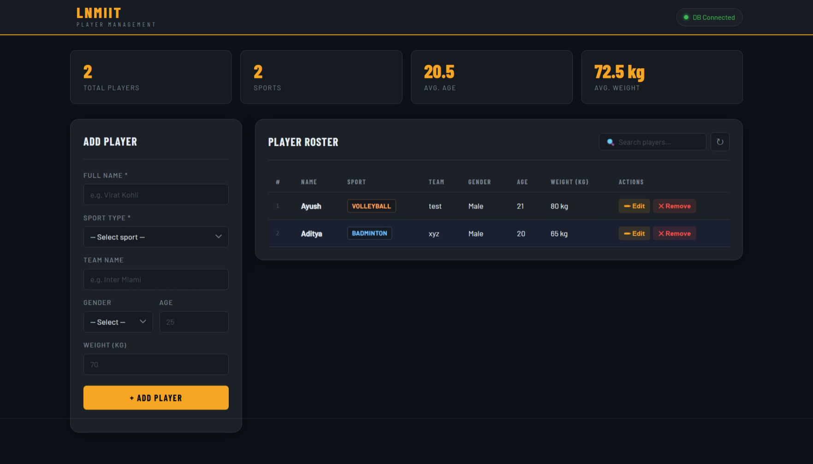

# Sports Player Management

A full-stack web application for managing player information across different sports. Built with Node.js, Express, MongoDB, and vanilla JavaScript.



---

## Table of Contents

- [Overview](#overview)
- [Features](#features)
- [Tech Stack](#tech-stack)
- [Project Structure](#project-structure)
- [Installation and Setup](#installation-and-setup)
- [Running the Project](#running-the-project)
- [API Endpoints](#api-endpoints)
- [Usage Guide](#usage-guide)
- [Database Schema](#database-schema)
- [Architecture](#architecture)
- [Troubleshooting](#troubleshooting)

---

## Overview

This system lets users manage player records for any sport. You can:
- Add new players with details like sport type, team, gender, age, and weight
- View all players in a table with live statistics
- Edit or delete existing players
- Search and filter players by name, sport, or team in real time

It runs as a single-page application with a REST API backend. No page reloads needed.

---

## Features

**Frontend:**
- Real-time search filtering (no page reload)
- Live stats dashboard (total players, sports count, average age, average weight)
- Add and edit players using a single form
- Delete players with confirmation
- Responsive layout for desktop and mobile
- Toast notifications for user feedback
- Client-side form validation
- Input validation feedback via toast notifications

**Backend:**
- RESTful API with GET, POST, PUT, DELETE endpoints
- MongoDB with Mongoose ODM for persistent storage
- Mongoose schema with built-in validation (regex, min/max, required fields)
- Environment variables for configuration (using dotenv)
- Modular code structure (separate files for models, routes, and database)
- Proper HTTP status codes and error handling

---

## Tech Stack

| Layer | Technology | Purpose |
|---|---|---|
| Frontend | HTML5, CSS3, Vanilla JavaScript | User interface |
| Backend | Node.js, Express.js | HTTP server and API |
| Database | MongoDB | Data storage |
| ODM | Mongoose | Schema definition, validation, and database queries |
| Config | dotenv | Environment variables |

### Dependencies
- `express` - Web framework for Node.js
- `mongoose` - MongoDB ODM with schema-based validation
- `dotenv` - Loads environment variables from `.env` file

---

## Project Structure

```
WP Project/
  .env                  # MongoDB URL and config (not committed to git)
  .gitignore            # Files to exclude from git
  server.js             # Entry point - starts the server
  db.js                 # Mongoose connection logic
  models/
    Player.js           # Mongoose schema and model for players
  routes/
    players.js          # All player CRUD API routes
  index.html            # Page structure and layout
  style.css             # Styling
  script.js             # Frontend logic and DOM handling
  package.json          # Dependencies and scripts
  README.md             # This file
  explanation.md        # Detailed code explanation
```

### File Responsibilities

| File | What it does |
|---|---|
| `server.js` | Loads config from `.env`, sets up Express middleware, mounts routes, starts the server |
| `db.js` | Connects to MongoDB using Mongoose |
| `models/Player.js` | Defines the Player schema with validation rules (regex, min/max, required, defaults) |
| `routes/players.js` | Handles all `/api/players` CRUD operations using the Player model |
| `index.html` | Contains the HTML for the form, stats bar, and player table |
| `style.css` | Dark theme styling with responsive layout |
| `script.js` | Makes API calls, renders the table, handles form submission, search, and stats |

---

## Installation and Setup

### Prerequisites
- Node.js (v14 or higher) - [Download](https://nodejs.org/)
- MongoDB (running locally) - [Download](https://www.mongodb.com/try/download/community)

### Step 1: Install Dependencies

```bash
cd "WP Project"
npm install
```

This installs `express`, `mongoose`, and `dotenv`.

### Step 2: Configure Environment

The `.env` file should already exist with these values:

```
MONGO_URI=mongodb://127.0.0.1:27017
DB_NAME=playerdb
PORT=3000
```

You can change these if your MongoDB runs on a different host or port.

### Step 3: Make Sure MongoDB is Running

```bash
mongod
```

MongoDB should be accessible at `mongodb://127.0.0.1:27017` by default.

---

## Running the Project

### Start the Server

```bash
npm start
```

Expected output:
```
Connected to MongoDB: playerdb
Server running at http://localhost:3000
```

### Open the App

Go to `http://localhost:3000` in your browser.

You should see:
- Header with DB connection status
- Stats bar showing player counts and averages
- Form on the left to add or edit players
- Player table on the right

### Stop the Server

Press `Ctrl + C` in the terminal.

---

## API Endpoints

Base URL: `http://localhost:3000/api/players`

### GET /api/players - Get All Players

Returns an array of all player documents.

Response (200):
```json
[
  {
    "_id": "507f1f77bcf86cd799439011",
    "name": "Virat Kohli",
    "sport": "Cricket",
    "team": "Royal Challengers Bengaluru",
    "gender": "Male",
    "age": 35,
    "weight": 75,
    "createdAt": "2024-01-15T10:30:00.000Z"
  }
]
```

### POST /api/players - Create a Player

Required fields: `name`, `sport`
Optional fields: `team`, `gender`, `age`, `weight`

**Validation rules (enforced by Mongoose schema):**
- `name` — required, 1-50 characters, letters and spaces only (`/^[A-Za-z\s]{1,50}$/`)
- `sport` — required
- `team` — optional, 1-50 characters, letters and spaces only
- `age` — number between 0 and 100
- `weight` — number between 0 and 200

Request body:
```json
{
  "name": "Virat Kohli",
  "sport": "Cricket",
  "team": "Royal Challengers Bengaluru",
  "gender": "Male",
  "age": 35,
  "weight": 75
}
```

Response (201): Returns the created player with its `_id`.
Response (400): Returns an error if validation fails.

### PUT /api/players/:id - Update a Player

Send the updated fields in the request body. Same validation rules as POST apply to `name` and `team`.

Response (200):
```json
{ "message": "Player updated successfully." }
```

Returns 400 if validation fails. Returns 404 if the player ID is not found.

### DELETE /api/players/:id - Delete a Player

Response (200):
```json
{ "message": "Player deleted successfully." }
```

Returns 404 if the player ID is not found.

---

## Usage Guide

### Adding a Player
1. Fill in the form on the left (Name and Sport Type are required)
2. Click "+ Add Player"
3. The player appears in the table and stats update

### Editing a Player
1. Click "Edit" on any row
2. The form fills with that player's data
3. Change what you need and click "Save Changes"

### Deleting a Player
1. Click "Remove" on any row
2. Confirm the deletion in the dialog
3. The player is removed and stats update

### Searching
1. Type in the search box above the table
2. The table filters as you type (searches name, sport, and team)
3. Clear the search to see all players

---

## Database Schema

### Mongoose Model: `Player` (Collection: `players`)

```javascript
{
  _id: ObjectId,        // auto-generated by MongoDB
  name: {
    type: String,       // required, trimmed, max 50 chars
    validate: /^[A-Za-z\s]{1,50}$/
  },
  sport: String,        // required, trimmed
  team: {
    type: String,       // defaults to "Free Agent", max 50 chars
    validate: /^[A-Za-z\s]{1,50}$/
  },
  gender: String,       // optional, trimmed
  age: Number,          // defaults to 0, range 0-100
  weight: Number,       // defaults to 0, range 0-200 (in kg)
  createdAt: Date,      // auto-generated by Mongoose timestamps
  updatedAt: Date       // auto-updated by Mongoose timestamps
}
```

Database name: `playerdb`
Collection name: `players`
Connection string: stored in `.env` file
ODM: Mongoose (schema defined in `models/Player.js`)

---

## Architecture

```
Browser (Client)
  index.html + style.css  -->  Displays the UI
  script.js               -->  Makes fetch() calls to the API
        |
        | HTTP requests (JSON)
        |
Node.js + Express (Server)
  server.js               -->  Entry point, middleware, static files
  db.js                   -->  Mongoose connection
  models/Player.js        -->  Schema definition and validation
  routes/players.js       -->  CRUD route handlers using Player model
        |
        | Mongoose ODM
        |
MongoDB (Database)
  playerdb.players        -->  Stores all player documents
```

### How Adding a Player Works
1. User fills the form and clicks "Add Player"
2. `script.js` sends a POST request to `/api/players`
3. `routes/players.js` creates a new `Player` instance from `req.body`
4. Mongoose validates the data against the schema before saving
5. If validation passes, the document is inserted into MongoDB
6. Server responds with the saved player document
7. `script.js` reloads the player list and updates the table and stats

### Key Design Decisions
- **Single-page app** - no page reloads, faster experience
- **REST API** - standard HTTP methods, easy to understand and test
- **Mongoose ODM** - schema-based validation, cleaner queries, no manual ObjectId handling
- **Async/await** - cleaner than callbacks, better error handling with try/catch
- **Modular files** - models, routes, database, and server setup are in separate files
- **Environment variables** - MongoDB URL is in `.env`, not hardcoded

---

## Troubleshooting

**MongoDB connection error:**
Make sure MongoDB is running. Start it with `mongod`.

**Port 3000 already in use:**
Either stop the other process or change the PORT value in `.env`.

**"Cannot find module" error:**
Run `npm install` to install dependencies.

**Empty player list:**
The database starts empty. Add your first player using the form.

**Changes not showing:**
Hard refresh the browser with `Ctrl + Shift + R` and check the console (F12) for errors.

---

Created for LNMIIT Sports Player Management System

Last Updated: May 6, 2026
