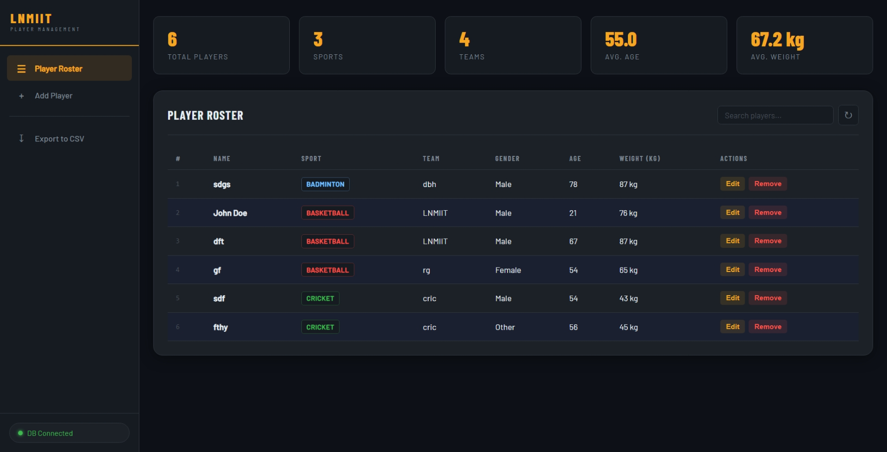
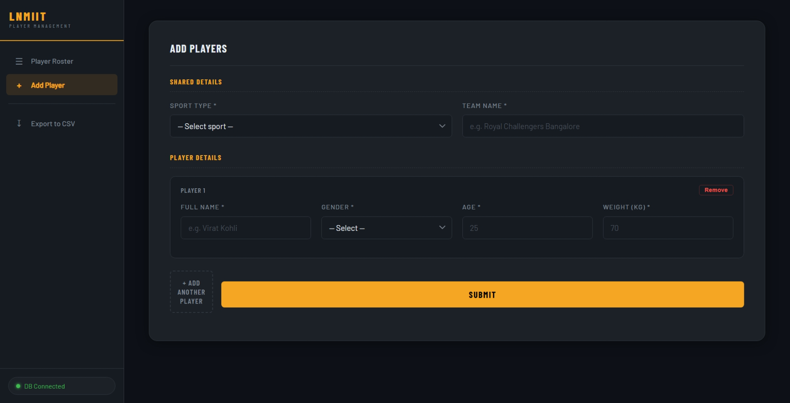

# Sports Player Management

A full-stack web application for managing player information across different sports. Built with Node.js, Express, MongoDB, and vanilla JavaScript. Features a modern dark industrial theme, sidebar navigation, and bulk player management.


---


---

## Table of Contents

- [Overview](#overview)
- [Features](#features)
- [Tech Stack](#tech-stack)
- [Project Structure](#project-structure)
- [Installation and Setup](#installation-and-setup)
- [Running the Project](#running-the-project)
- [API Endpoints](#api-endpoints)
- [Usage Guide](#usage-guide)
- [Database Schema](#database-schema)
- [Architecture](#architecture)
- [Troubleshooting](#troubleshooting)

---

## Overview

This system lets users manage player records for any sport with a focus on speed and ease of use. You can:
- **Bulk Add Players**: Set shared details (Sport, Team) once and add multiple player records with unique names, genders, and physical stats.
- **Side Panel Navigation**: Quickly switch between the Player Roster and the Add Player form.
- **Export Data**: Download your entire roster as a CSV file for external use.
- **Live Statistics**: View a real-time dashboard of total players, sports, teams, and averages.
- **Dynamic Search**: Filter the roster instantly by name, sport, or team.
- **Sorted Roster**: The list is automatically organized by Sport, then by Team Name.

---

## Features

**Frontend:**
- **Sidebar Navigation**: Persistent left-side menu for intuitive page switching.
- **Bulk Entry Form**: Add multiple players in a single submission with dynamic row generation.
- **CSV Export**: Client-side generation and download of player data.
- **Real-time Search**: Instant filtering of the roster table.
- **Live Stats Dashboard**: Now includes total counts for players, sports, and unique teams.
- **Responsive Layout**: Sidebar collapses on mobile with a dedicated toggle menu.
- **Toast Notifications**: Modern feedback system for all CRUD and validation events.

**Backend:**
- **Bulk API Endpoint**: Dedicated route for efficient batch inserts.
- **RESTful Architecture**: Clean separation of GET, POST, PUT, and DELETE operations.
- **Mongoose ODM**: Robust schema-level validation and data integrity.
- **Environment Driven**: Secure configuration using `.env`.

---

## Tech Stack

| Layer | Technology | Purpose |
|---|---|---|
| Frontend | HTML5, CSS3, Vanilla JavaScript | UI and SPA navigation |
| Backend | Node.js, Express.js | API logic and static file serving |
| Database | MongoDB | Scalable document storage |
| ODM | Mongoose | Schema validation and DB interaction |
| Config | dotenv | Environment management |

---

## Project Structure

```
WP Project/
  .env                  # MongoDB URL and config
  server.js             # Server entry point
  db.js                 # Mongoose connection logic
  models/
    Player.js           # Player schema and validation
  routes/
    players.js          # CRUD and Bulk API routes
  index.html            # Main SPA structure (Sidebar + Pages)
  style.css             # Industrial dark theme styling
  script.js             # SPA logic, Bulk entry, and API handling
  package.json          # Dependencies and scripts
```

---

## API Endpoints

Base URL: `http://localhost:3000/api/players`

### GET /api/players
Returns all players, automatically sorted by Sport then Team.

### POST /api/players
Create a single player. All fields (`name`, `sport`, `team`, `gender`, `age`, `weight`) are validated.

### POST /api/players/bulk
Create multiple players at once. 
Request body: `{ "players": [...] }`

### PUT /api/players/:id
Update an existing player. Returns 404 if not found.

### DELETE /api/players/:id
Remove a player from the system.

---

## Usage Guide

### Bulk Adding Players
1. Select **"Add Player"** from the sidebar.
2. Enter the **Shared Details** (Sport, Team) at the top.
3. Enter player-specific details (Name, Gender, Age, Weight) in the first row.
4. Click **"+ Add Another Player"** to append more rows.
5. Click **"Submit"** to save all players at once.

### Exporting Data
1. Select **"Export to CSV"** from the sidebar.
2. A `players_roster.csv` file will be generated and downloaded automatically.

### Editing a Player
1. In the **Player Roster**, click **"Edit"** on a player's row.
2. The app will switch to the Add Player view and pre-fill the form.
3. Update the details and click **"Save Changes"**.

---

## Database Schema

Managed via Mongoose in `models/Player.js`:
- `name`: String (Letters/Spaces only, max 50)
- `sport`: String (Required)
- `team`: String (Required, max 50)
- `gender`: String (Required)
- `age`: Number (15-100)
- `weight`: Number (30-200)
- `timestamps`: `createdAt` and `updatedAt` added automatically.

---

Created for LNMIIT Sports Player Management System
Last Updated: May 6, 2026
